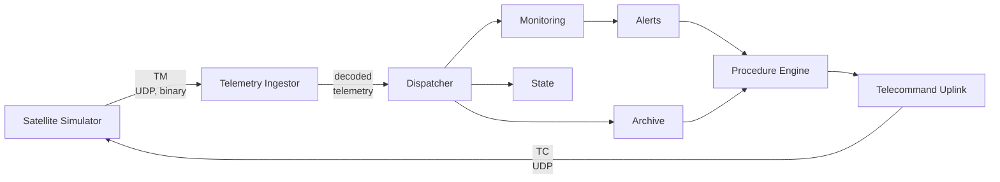

# Mini Mission Control System (MCS)

This project is a **prototype Mission Control System (MCS)** built to explore how modern ground-segment software can be structured for telemetry ingestion, monitoring, alerting, telecommanding, and basic autonomous operations, inspired by common space industry practices (e.g. [CCSDS-style telemetry and telecommand concepts](https://public.ccsds.org)). The focus of this project is system design and operational semantics.

# Running the System

The system is fully containerized.

```bash
docker compose up --build
```

This will start:

- the satellite simulator
- the telemetry ingestor
- the REST API

All components communicate via Docker networking.

# High-Level Architecture



# Example Runtime Behavior
The following excerpt shows the system reacting autonomously to a low-battery condition executing a safety procedure.


# Core Components
## 1. Satellite Simulator

📁 `mcs/sat_simulator/`

- Generates binary telemetry packets (Housekeeping, Attitude)
- Maintains an internal spacecraft state
- Receives telecommands
- Emits telecommand verification telemetry (`ACCEPTED` / `EXECUTED` / `FAILED`)

## 2. Telemetry Ingestor

📁 `mcs/tm_ingestor/`

- Receives raw telemetry bytes via UDP
- Validates packet integrity using CRC
- Routes packets by packet ID
- Decodes telemetry into typed domain models

## 3. Telemetry Dispatcher

📁 `mcs/tm_ingestor/dispatcher`

- Decouples decoding from downstream consumers
- Fans out telemetry to:
  - monitoring
  - archiving
  - state updates

## 4. Monitoring & Alerting

📁 `mcs/tm_ingestor/monitoring` `mcs/tm_ingestor/alerts`

- Monitoring rules are data-driven (JSON)
- Rule evaluation is stateless
- Alerts have a lifecycle:
  - `NEW`
  - `ACKNOWLEDGED`
  - `CLEARED`
- Alerts are persisted for auditability

## 5. Telecommand Uplink & Verification

📁 `mcs/tc_uplink`

- Telecommands are packetized and sent via UDP
- Each telecommand is verified by telemetry:
  - `ACCEPTED`
  - `EXECUTED`
  - `FAILED`

## 6. Procedure Engine

📁 `mcs/procedures`

- Procedures are defined declaratively (JSON)
- Procedures are triggered by alerts
- A procedure executes a deterministic sequence of steps:
  - send telecommands
  - wait
  - verify execution via telemetry

# Design Principles

- telemetry is the authoritative source of truth
- components are decoupled via explicit interfaces
- monitoring and procedures are data-driven
- command success is verified via telemetry, not assumed
- behavior is deterministic and auditable
